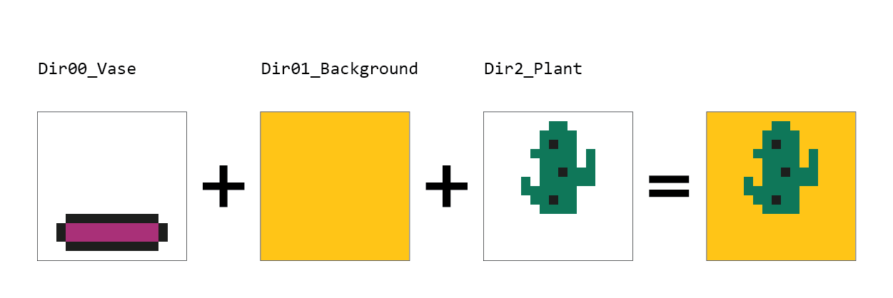

# Merge Image Combinations

## Sobre

O script recebe um conjunto de imagens separadas por categoria, por exemplo: cor de fundo, vasos e plantas, então ele gera uma imagem pra cada combinação possível com todas as imagens.

Exemplo:


---

## Instalações necessárias

- [Python 3.9 ou superior](https://www.python.org)

```
sudo apt-get install python3
sudo apt-get install python3-pip
```

- [Biblioteca pillow](https://pillow.readthedocs.io/en/stable/installation.html)

```
python3 -m pip install --upgrade pip
python3 -m pip install --upgrade Pillow
```

---

## Como usar

1. Faça as instalações necessárias caso ainda não tenha as mesmas instaladas
2. Copie este repositório no seu computador, ou faça o download do .zip
    - Caso tenha baixado o .zip extraia os arquivos, e entre na pasta "script"
3. Organize as suas imagens desejadas nos diretórios separadas por tema, por padrão o script vem com apenas 3 diretórios mas você pode criar mais ou deletar algum, de acordo com sua necessidade
4. Execute o script, usando o comando no terminal:

```
Python Merge.py
```

5. Acesse a pasta raiz do script e entre na pasta "output" as imagens geradas estarão lá!

---

## Observações

1. O script aceita qualquer tipo de imagem, porém é recomendado usar o formato **PNG** por possuir o fundo transparente
2. Pode utilizar qualquer nome para as pastas do input, porém é recomendado manter o formato de ***dir00_xxxxx*** onde xxxxx é o nome pro grupo de imagens que você irá colocar
3. Ao combinar as imagens, o sript leva em consideração a numeração dos diretórios para criar cada camada, então caso você coloque o fundo no ***dir01_xxxxx*** ele ira ficar acima das outras imagens quando o script for executado.

Por exemplo:


<br><br>

então para não ter esse problema, prefira organizar os diretórios assim:

